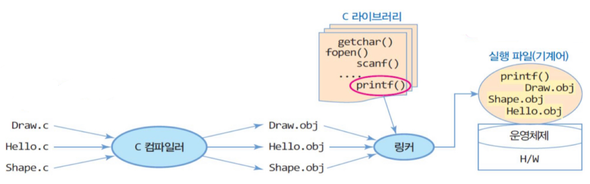
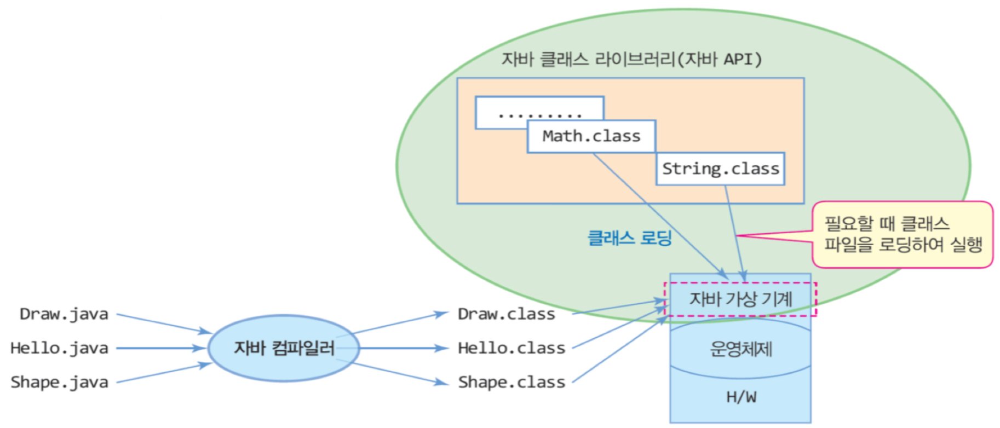

# **1. OOP와 Java**

## **OOP (; Object Oriented Programming)**
### **❖ def)**
: 객체 지향 프로그래밍으로, 대표적으로 캡슐화, 추상화, 다형성, 상속성 라는 특징을 띄고 있다.  
- 캡슐화
    - : 하나의 객체에 대해 그 객체가 특정한 목적을 위해 필요한 변수나 메소드를 하나로 묶는 것
    - 캡슐화의 가장 큰 목적은 정보 은닉화
- 추상화
    - : 목적과 관련이 없는 부분을 제거하고, 공통의 속성이나 기능을 묶어 이름을 붙이는 것
- 다형성
    - : 형태가 같은데 다른 기능을 하는 것  
    - 코드의 재사용, 코드 길이 감소 → 유지보수 용이
- 상속성
    - : 기존 상위클래스에 근거하여 새롭게 클래스와 행위를 정의할 수 있게 도와주는 것
    - 부모(상위 클래스)의 특징(멤버변수나 멤버메서드)을 자식(하위 클래스)이 물려받음
  
### **❖ OOP와 PP**
&nbsp; 컴퓨터공학부에 진학 후 처음 접하는 프로그래밍 언어는 대부분 C laguage일 것이다. 이후 Java를 공부하면서 OOP(; Object Oriented Programming)를 처음 접하게 되고, PP(; Procedure Programming)와의 차이점에 대해서 생각하게 된다. 그리고 의문점이 든다. "프로그램은 어떻게 짜든 절차적으로 돌아가지 않나?" 객체를 지향하든, 절차를 지향하든 프로그램은 기본적으로 절차에 따라서 동작하기 때문이다.  
</br>
&nbsp; PP에서 Procedure는 번역하면 절차가 맞지만, 사실 함수라는 뜻도 내포하고 있다. 따라서 PP는 데이터를 모아 함수로 만들어 절차대로 프로그래밍한다고 해석할 수 있다. 실행하고자 하는 절차대로 흐름도(순서도)를 설계하여 이를 기준으로 프로그램을 작성한다. 우리가 사용해봤던 C language가 대표적인 PP다.  
</br>
&nbsp; OOP는 말 그대로 객체지향 프로그래밍이다. 데이터의 기능을 모아 하나의 객체를 만들어 프로그래밍 한다는 의미다. 이 때는 객체들의 관계 등에 초점을 맞추어 프로그래밍 한다. 대표적으로 Java와 Python이 있다. (Python은 정확히 객체 지향 언어이면서 함수형 언어다.)  
</br>
&nbsp; 그렇다면 어떻게 프로그래밍 해야 PP이고, 또 어떻게 프로그래밍 해야 OOP일까? 현금용 음료수 자판기를 예로 들어보자. "자판기를 어떻게 사용해야 해요?"라는 질문에 우리는 아래와 같이 대답할 수 있다.
```text
  i) 고객이 자판기에 돈을 넣는다,
 ii) 자판기에서 돈을 검사한다.
iii) 고객이 제품을 고르고, 자판기는 계산하여 제품과 잔돈을 불출한다.
 iv) 고객이 제품과 잔돈을 가져간다.
```  
</br>
&nbsp; PP의 방식으로 프로그래밍 한다면 함수와 전역 변수를 통해 하나의 파일에서 개발할 수 있다. 음료 a의 잔여 개수를 전역 변수로 두고, 품절인지 확인하는 함수, 투입된 돈과 가격을 비교해주는 함수 등으로 말이다. 하지만 이렇게 프로그램을 구성한다면 당연히 코드의 길이가 길어질 것이다. 나중에 새로운 음료가 추가되거나 기존의 음료가 더 이상 생산하지 않게 됐을 때 코드를 수정하기 힘들 것이다.  

</br>
&nbsp; 그럼 OOP는 어떻게 프로그래밍 할까? 고객과 자판기, 음료를 객체로 두어 Main에서는 이 객체들의 멤버 변수, 메서드로 간단히 프로그래밍할 수 있다. 위에서 말한 음료에 관한 이슈를 해결하는 것도 수월하다. (나중에 자세히 배우겠지만,) interface(언어마다 다르다)로 음료의 기본적인 틀을 만들어 놓고, 종류별로 그 interface를 구현해주기만 하면 된다. 음료a 생산이 중단되면 음료a 클래스를 지워주면 되고, 음료z가 추가되면 interface를 따라서 구현만 해주면 된다.  

</br>
&nbsp; 당연히 모든 프로그래밍에서 OOP가 답은 아니다. PP와 OOP의 장단점을 정리하면서 이 주제를 넘어가보자.  

</br>

```
                    PP(; Procedure Progamming)

📝 장점
- 객체나 클래스를 만들 필요 없이 바로 프로그램 코딩 가능
- 필요한 기능을 함수로 만들어 두기 때문에 같은 코드를 복사하지 않고 호출하여 사용 가능
- 프로그램의 흐름 쉽게 추적 가능
 
📝 단점
- 각 코드가 매우 유기성이 높기 때문에 유지보수가 힘듦 
- 프로그램 전체에서 코드를 재사용 불가능
- 디버깅 과정이 어렵움
```
 
```
                    OOP(; Object Oriented Programming)
📝 장점
- 모듈화, 캡슐화 → 유지보수 용이
- 현실 세계와 유사 → 코드를 이해하기 쉬움
- 객체는 그 자체가 하나의 프로그램 → 다른 프로그램에서 재사용이 가능하다.
 
📝 단점
- 대부분의 객체 지향 프로그램은 속도가 상대적으로 느려지고 많은 양의 메모리를 사용
- 현실 세계와 유사성에 의해 코드를 이해하기 쉽게 만드는 만큼 설계 과정에 시간이 많이 투자됨
```
</br>

## **Java**
### **❖ Java의 역사**
&nbsp; Java는 1991년, **Sun Microsystems**의 엔지니어들에 의해 고안된 **Oak**라는 언어에서 부터 출발됐다. **제임스 고슬링** 등의 엔지니어들은 가전제품에 탑재될 SW를 만드는 것이었는데, C++을 확장해서 사용하려 했지만 목적을 이루기에 부족하다는 것을 깨달았다.  
</br>

&nbsp; 그렇게 C++의 장점을 도입하고, 단점을 보완한 새로운 언어를 개발했고, 그것이 바로 **Oak**다. 처음엔 소형기기에 사용될 목적이었으나, 인터넷의 등장으로 인해 OS에 독립적인 Oak가 이에 적합하다고 판단하여 개발 방향을 바꾸었고, 이름을 **Java**로 변경했다. 그렇게 자바로 개발한 **Hot Java**를 발표하고, 1996년 1월에 **Java**의 정식 버전을 발표했다.  
</br>

&nbsp; 그렇게 자바로 작성된 **Applet**이 인기를 끌었고, 보안상의 이유로 Applet을 더 이상 지원하지 않게 되자 **Servlet**과 **JSP**가 많이 사용됐다. 이후 **AOS**에서도 사용되고, **Spring**의 등장으로 많은 기업에서 사용하는 언어가 되었다.  

### **❖ Java의 특징과 OOP**
&nbsp; Java는 많은 개발자들에게 사랑을 받고 있는 언어다. 기존에 인기 있던 다른 언어에는 없는 장점을 가지고 있기 때문이다. 그럼 어떤 특징이 있는지 알아보자.

> #### **1. OS에 독립적이다.**
> &nbsp; Windows 환경에서 C 코드를 작성하고 Mac OS에서 실행하면 오류가 발생할 수 있다. 하지만 Java는 그렇지 않다. JVM(; Java Virtual Machine)이 있기 때문이다. 이 부분에 대해선 다음에 다시 자세히 알아보자.  

> #### **2. 객체지향언어이다.**
> &nbsp; Java는 OOP의 특징을 모두 적용하고 있다. 클래스와 접근지정자로 캡슐화를 만족하고, 상속을 지원하며, Overloading, Overriding, Interface를 통해 다형성을 만족한다.  

> #### **3. 가비지 컬렌션**
> &nbsp; Java 파일이 실행되면 **Garbage Collector**가 자동적으로 메모리를 관리해주기 때문에 프로그래머가 메모리 관리를 따로 하지 않아도 된다. C++과 같이 소멸자를 만들 필요가 없다는 말이다.  

> #### **4. 네트워크와 분산처리를 지원한다**
> &nbsp; 풍부하고 다양한 네트워크 프로그래밍 라이브러리를 통해 비교적 짧은 시간에 네트워크 관련 프로그램을 쉽게 개발할 수 있도록 지원한다.  

> #### **5. 멀티 쓰레드를 지원한다.**
> &nbsp; Java에서 개발되는 멀티 쓰레드 프로그램은 시스템과는 관계없이 구현 가능하며, 관련된 라이브러리가 제공되므로 구현이 쉽다. 그리고 여러 쓰레드에 대한 스케줄링을 자바 인터프리터가 담당하게 된다.  

> #### **6. 동적 로딩을 지원한다.**
> &nbsp; 동적 로딩을 지원하기 때문에 실행 시에 모든 클래스가 로딩되지 않고 필요한 시점에 클래스를 로딩하여 사용할 수 있다는 장점이 있다.  

### **❖ Java 프로그램의 구동 과정과 JVM**
&nbsp; 위에서 Java는 JVM이 있기 때문에 플랫폼에 독립적이라고 했다. JVM이란 Java Virtual Machine의 약자로, 직역하면 자바를 실행하기 위한 가상 기계지만, 의역해서 기계를 컴퓨터라고 생각하면 된다. Java로 작성된 Application은 JVM에서만 실행되기에 실행을 위해 꼭 필요하다. 이 부분에 대해 C language와 구동 과정을 비교하면서 자세히 알아보자.  
<div align=center>
    
    
</div>  
</br>

* * *

# **2. Java의 기본 문법**
## **시작에 앞서**
### **❖ 기본적인 설정**
→ jdk 버전 11이상을 기준으로 eclipse 환경에서 실습을 진행한다.  

### **❖ Java 프로그램의 기본 구성**
```java
1   import java.util.*;
2
3   public class Sample {
4       public static void main(String[] args) {
5           Mentor a = new Mentor();
6           Menti b = new Menti();
7   
8           a.mentoring();
9           b.study();
10      }
11  }
```
- 1열: 라이브러리 import
- 3열: class 부분으로, 한 파일에 여러 개의 class를 구현할 수는 있으나 public class는 한 개만 구현 가능
- 4열: main() 메서드
- 5~9열: 객체 선언 및 생성, 메서드 호출

```text
❗️ Q) 함수(function)와 메서드(method)는 뭐가 다른가요?
A) 간단하게 이야기하면 함수는 메서드를 포함하는 개념이다. 함수란 여러 문장들이 하나의 기능을 구현하도록 구성한 것이다. 그 함수 중에서 클래스 내부에 정의한 함수가 바로 메서드다. 메서드는 객체의 속성을 다루기 위한 행위를 정의하고 있다고 말할 수 있다.
```

## **자료형**
### **❖ 기본 타입**
<div align=center>
    
</div>  

### **❖ 레퍼런스 타입**
- Class
- Array
- Interface  

## **입출력**
&nbsp; Java는 모두 객체로 이루어져 있다. 따라서 입력이나 출력 또한 객체에서 메서드를 호출하는 방식으로 이루어진다. 입출력에는 크게 두 가지 방법이 있는데, 먼저 간단한 Scanner 객체와 out 객체를 이용한 방법이 있고, 보다 복잡한 BufferedReader와 BufferedWriter를 이용한 방법이 있다. 자세히 한 번 알아보자.

### **❖ Scanner와 out**
&nbsp; **Scanner**는 화면, 파일, 문자열과 같은 입력소스로부터 문자 데이터를 읽어오기 위한 목적으로 JDK 1.5부터 추가되었다. 여러 오버로딩 된 생성자를 지원하기 때문에 다양한 입력 소스로부터 데이터를 읽을 수 있다. 덕분에 JDK 1.6부터는 화면 입출력만 전문적으로 담당하는 java.io.Console이 새로 추가되었다. (나머지는 Scanner가 모두 수행할 수 있기 때문이다.)  
```java
Scanner sc = new Scanner(System.in);

int i = sc.nextInt();
boolean b = sc.nextBoolean();
String s = sc.nextLine();
```
</br>

&nbsp; 또 Scanner는 기존의 방식과 다르게 nextLine( ) 대신 nextInt( ), nextLong( ) 등과 같은 타입별 메서드를 가지고 있다. 따라서 **import java.util.Scanner;**만 해주면 입력 받은 문자를 다시 원하는 타입으로 변환하는 수고를 덜어 준다.  
</br>

&nbsp; out 객체는 출력을 돕는다. 일반적으로 세 가지가 있는데, print(), println(), printf()가 있는데, 아래 코드를 보고 이해해보자.  
```java
System.out.println("Hello");
System.out.print("Hello");
System.out.printf("%d", num);
```  

### **❖ BufferedReader와 BufferedWriter**
&nbsp; **BufferedReader**와 **BufferedWriter**는 버퍼를 이용해서 입출력의 효율을 높일 수 있도록 해주는 역할을 한다. (Scanner와 BufferedReader의 차이에 대한 글이므로 BufferedWriter에 대한 설명은 생략한다.) BufferedReader의 readLine( ) 메서드를 사용하면 데이터를 라인 단위로 읽을 수 있다. 그럼 BufferedReader를 사용하는 방법에 대해 알아보자.  
</br>

```java
import java.io.IOException;
import java.io.BufferedReader;
import java.io.InputStreamReader;

class BufferedReaderEx {
	public static void main(String[] args) throws IOException {
		BufferedReader br = new BufferedReader(new InputStreamReader(System.in));
        
		String s = br.readLine();
		int i = Integer.parseInt(br.readLine);
	}
}
```  
&nbsp; 먼저 위의 패키지를 import 해줘야 한다. 굳이 외울 필요 없이 **Ctrl+Shift+o**를 눌러주면 Eclipse에서 자동으로 import 해주지만, 코딩 테스트를 준비한다면 외워두는 것을 권장한다.  
 
&nbsp; 그 다음 부터는 main 클래스 안의 코드처럼 활용하면 된다. String 타입이 아닌 타입을 받기 위해서는 위와 같이 형변환이 필요하다.  
 
&nbsp; 여기서 주의할 점은 예외처리가 꼭 필요하다는 점이다. 방법은 두 가지인데, readLine( )을 할 때마다 try~catch문을 활용하거나 throws IOException을 통하여 작업하는 것이다. 대개는 throws IOException을 활용한다. 이 때는 **import java.io.IOException** 패키지를 import 해주고, main 클래스 옆에 **throws IOException**을 작성한다.  

```java
BufferedReader br = new BufferedReader(new InputStreamReader(System.in));

StringTokenizer st = new StringTokenizer(br.readLine(), " ");
int n = Integer.parseInt(st.nextToken());
int m = Integer.parseInt(st.nextToken());

int[] arr = br.readLine().split(" ");
```  
&nbsp; 앞서 말했듯이 BufferedReader의 readLine( ) 메서드는 데이터를 라인 단위로 읽는다. 만약 공백 단위로 데이터를 가공하려면 위와 같은 방법을 사용하면 된다. 첫 번째 방법은 StringTokenizer를 활용하는 방법이고, 두 번째 방법은 split을 활용하는 방법이다. (StringTokenizer에 대해서는 나중에 다시 다루겠다.)

### **❖ Scanner와 BufferedReader**
&nbsp; BufferedReader를 설명할 때 말했듯이 BufferedReader는 JDK 1.5 이전부터 사용됐지만, 즉 Scanner보다 오래됐지만, 버퍼를 이용하기에 입출력의 효율이 비교할 수 없을 정도로 좋아진다. 그렇다면 BufferedReader가 무조건 좋을까? 그건 아니다. Buffer를 사용하기 때문에 BufferedReader가 Scanner보다 메모리 효율에서 떨어진다.   
 
&nbsp; 결론을 말하자면 입출력의 효율을 높이려면 BufferedReader를 사용하면 되고, 메모리의 효율을 높이려면 Scanner를 사용하면 된다.   
 
&nbsp; ps. 백준 알고리즘 사이트에서 문제를 풀다보면 가끔 정답인데도 시간초과의 문제로 오답 처리가 된다. 이 때는 문제에서 시간 제한을 확인하면 된다. 1초, 2초일 때는 크게 상관없지만, 0.15초와 같이 150ms 안에 프로그램이 종료해야 하는 문제에서는 BufferedReader를 사용하는 것이 효율적이다. (Scanner를 사용해서 풀면 대부분 100ms가 넘기 때문이다.)  

## **조건문**
&nbsp; 다른 언어와 똑같이 **if-else if-else**문과 **switch-case**문을 사용한다. 다른 언어와 비슷하므로 자세한 코드 설명은 생략한다. **switch-case**문이 if문보다 많은 데이터를 처리할 때 보다 효율적이므로, 상황이 맞으면 switch-case문을 사용하는 것이 좋다.

## **반복문**
&nbsp; 반복문 또한 다른 언어와 비슷하다. for문, while문, do-while문이 있다. 사용법은 다른 언어와 동일하고, 몇 언어에는 없는 for-each문이 구현돼 있다. 아래 코드로 for-each문만 보고 넘어가도록 하자.  
```java
ArrayList<Person> people = new ArrayList<>();

...

for(Person p : people){
    System.out.println("이름: " + p.getName());
}
```

## **배열**
&nbsp; 배열은 같은 타입의 여러 변수를 하나의 묶음으로 다루는 것이다. 프로그래밍 언어를 배우면 입출력, 자료형, 그리고 조건문, 반복문을 공부하고 배열을 공부하기 때문에 대부분의 사람들은 배열에 대해 기본적인 지식이 있을 것이다. 따라서 바로 배열 선언과 생성을 알아보자.  
```java
type[] array = new type[number]
```  
&nbsp; 배열에 대해 공부하면 얕은 복사, 깊은 복사 등 간단하면서 복잡한 개념들을 공부하게 되는데, 오늘은 배열을 길이를 알 수 있는 인스턴스 변수 length만 기억하면 된다.  

ps. 배열은 index를 통해 각 요소에 접근하기 때문에 탐색 속도가 매우 빠르다. 따라서 요즘은 크기가 큰 배열을 선언하여 보다 효율적이고 빠른 프로그램을 구현하기도 한다고 한다.

## **String**
&nbsp; Java를 접하기 전에 C를 접했다면 문자열을 다룰 때 '문자열 타입이 하나 있으면 되지, 왜 이렇게 귀찮게 사용해야 하지?' 라는 생각을 한번쯤은 해봤을 것이다. 문자열을 다루기 위해 char 배열이나 포인터를 사용해야 했다. 하지만 Java는 우리가 그토록 원했던 String Type을 제공, 정확히는 String Class를 미리 구현해 놓았다. 

```java
public final class String implements java.io.Serializable, Comparable {
    private char[] value;
    // . . .
}
```  
&nbsp; 한편, String 클래스는 저장된 문자열을 읽어올 수만 있고, 변경할 수는 없는 immutable 클래스다. 예를 들어 '+' 연사자를 이용해서 문자열을 결합하는 경우는 객체 내의 문자열을 바꾸는게 아니라 새로운 문자열이 담긴 String 객체를 생성하는 것이다. 따라서 문자열을 결합하는 것은 메모리 공간을 낭비하는 것과 같으므로 결합횟수를 최대한 줄이는 것이 좋다. 추가로 결합이나 추출 등 문자열을 다루는 작업이 많을 경우엔 String 클래스 대신 StringBuffer 클래스를 사용하는 것이 좋다.  

```java
String s1 = "abc";
String s2 = "abc";
String s3 = new String("abc");
String s4 = new String("abc");

System.out.println(s1==s2);
System.out.println(s3==s4);
```  

&nbsp; 위의 코드를 보자. 1, 2열은 문자열 리터럴 "abc"의 주소에 객체를 저장한 사례이고, 3, 4열은 새로운 String 객체를 생성한 사례다. 따라서 s1과 s2는 같은 문자열 "abc"의 주소를 가리키고 있고, s3와 s4는 같은 문자열이지만 서로 다른 주소를 가지고 있다. 위 코드를 실행해 출력 결과를 확인하면 완벽히 이해갈 것이다.  

<table style="border-collapse: collapse; width: 100%; height: 867px;" border="1" data-ke-align="alignLeft" data-ke-style="style4">
<tbody>
<tr style="height: 19px;">
<td style="width: 31.6278%; height: 19px; text-align: center;"><span style="font-family: 'Noto Sans Demilight', 'Noto Sans KR';"><b>Method</b></span></td>
<td style="width: 20.1164%; height: 19px; text-align: center;"><span style="font-family: 'Noto Sans Demilight', 'Noto Sans KR';"><b>Explain</b></span></td>
<td style="width: 32.7908%; height: 19px; text-align: center;"><span style="font-family: 'Noto Sans Demilight', 'Noto Sans KR';"><b>Example code</b></span></td>
<td style="width: 15.465%; height: 19px; text-align: center;"><span style="font-family: 'Noto Sans Demilight', 'Noto Sans KR';"><b>Example Value</b></span></td>
</tr>
<tr style="height: 19px;">
<td style="width: 31.6278%; height: 19px;"><span style="font-family: AppleSDGothicNeo-Regular, 'Malgun Gothic', '맑은 고딕', dotum, 돋움, sans-serif;">char <span style="color: #ee2323;"><b>charAt</b></span>(int index)</span></td>
<td style="width: 20.1164%; height: 19px;"><span style="font-family: AppleSDGothicNeo-Regular, 'Malgun Gothic', '맑은 고딕', dotum, 돋움, sans-serif;">지정된 인덱스에 있는 문자 리턴</span></td>
<td style="width: 32.7908%; height: 19px;">&nbsp;</td>
<td style="width: 15.465%; height: 19px;"><span style="font-family: AppleSDGothicNeo-Regular, 'Malgun Gothic', '맑은 고딕', dotum, 돋움, sans-serif;">c = 'e'</span></td>
</tr>
<tr style="height: 19px;">
<td style="width: 31.6278%; height: 19px;"><span style="font-family: AppleSDGothicNeo-Regular, 'Malgun Gothic', '맑은 고딕', dotum, 돋움, sans-serif;">int <span style="color: #ee2323;"><b>compareTo</b></span>(String str)</span></td>
<td style="width: 20.1164%; height: 19px;"><span style="font-family: AppleSDGothicNeo-Regular, 'Malgun Gothic', '맑은 고딕', dotum, 돋움, sans-serif;">문자열과 사전순서로 비교하여 이전이면 음수, 이후면 양수 리턴</span></td>
<td style="width: 32.7908%; height: 19px;"><span style="font-family: AppleSDGothicNeo-Regular, 'Malgun Gothic', '맑은 고딕', dotum, 돋움, sans-serif;">int i = "aaa".compareTo("aaa");</span><br /><span style="font-family: AppleSDGothicNeo-Regular, 'Malgun Gothic', '맑은 고딕', dotum, 돋움, sans-serif;">int ii = "aaa".compareTo("bbb");</span><br /><span style="font-family: AppleSDGothicNeo-Regular, 'Malgun Gothic', '맑은 고딕', dotum, 돋움, sans-serif;">int iii = "bbb".compareTo("aaa");</span></td>
<td style="width: 15.465%; height: 19px;"><span style="font-family: AppleSDGothicNeo-Regular, 'Malgun Gothic', '맑은 고딕', dotum, 돋움, sans-serif;">i = 0</span><br /><span style="font-family: AppleSDGothicNeo-Regular, 'Malgun Gothic', '맑은 고딕', dotum, 돋움, sans-serif;">ii = -1</span><br /><span style="font-family: AppleSDGothicNeo-Regular, 'Malgun Gothic', '맑은 고딕', dotum, 돋움, sans-serif;">iii = 1</span></td>
</tr>
<tr style="height: 19px;">
<td style="width: 31.6278%; height: 19px;"><span style="font-family: AppleSDGothicNeo-Regular, 'Malgun Gothic', '맑은 고딕', dotum, 돋움, sans-serif;">String <span style="color: #ee2323;"><b>concat</b></span>(String str)</span></td>
<td style="width: 20.1164%; height: 19px;"><span style="font-family: AppleSDGothicNeo-Regular, 'Malgun Gothic', '맑은 고딕', dotum, 돋움, sans-serif;">문자열을 뒤에 덧붙여서 리턴</span></td>
<td style="width: 32.7908%; height: 19px;"><span style="font-family: AppleSDGothicNeo-Regular, 'Malgun Gothic', '맑은 고딕', dotum, 돋움, sans-serif;">String s = "Hello";</span><br /><span style="font-family: AppleSDGothicNeo-Regular, 'Malgun Gothic', '맑은 고딕', dotum, 돋움, sans-serif;">String s2 = s.concat(" !");</span></td>
<td style="width: 15.465%; height: 19px;"><span style="font-family: AppleSDGothicNeo-Regular, 'Malgun Gothic', '맑은 고딕', dotum, 돋움, sans-serif;">s2 = "Hello !"</span></td>
</tr>
<tr style="height: 19px;">
<td style="width: 31.6278%; height: 19px;"><span style="font-family: AppleSDGothicNeo-Regular, 'Malgun Gothic', '맑은 고딕', dotum, 돋움, sans-serif;">boolean <span style="color: #ee2323;"><b>contains</b></span>(CharSequence c)</span></td>
<td style="width: 20.1164%; height: 19px;"><span style="font-family: AppleSDGothicNeo-Regular, 'Malgun Gothic', '맑은 고딕', dotum, 돋움, sans-serif;">지정된 문자열이 포함돼 있는지 리턴</span></td>
<td style="width: 32.7908%; height: 19px;"><span style="font-family: AppleSDGothicNeo-Regular, 'Malgun Gothic', '맑은 고딕', dotum, 돋움, sans-serif;">String s = "abcd";</span><br /><span style="font-family: AppleSDGothicNeo-Regular, 'Malgun Gothic', '맑은 고딕', dotum, 돋움, sans-serif;">boolean b = s.contains("bc");</span></td>
<td style="width: 15.465%; height: 19px;"><span style="font-family: AppleSDGothicNeo-Regular, 'Malgun Gothic', '맑은 고딕', dotum, 돋움, sans-serif;">b = true</span></td>
</tr>
<tr style="height: 22px;">
<td style="width: 31.6278%; height: 22px;"><span style="font-family: AppleSDGothicNeo-Regular, 'Malgun Gothic', '맑은 고딕', dotum, 돋움, sans-serif;">boolean <b>endsWith</b>(Stringsuffix)</span></td>
<td style="width: 20.1164%; height: 22px;"><span style="font-family: AppleSDGothicNeo-Regular, 'Malgun Gothic', '맑은 고딕', dotum, 돋움, sans-serif;">지정된 문자열로 끝나는지 리턴</span></td>
<td style="width: 32.7908%; height: 22px;"><span style="font-family: AppleSDGothicNeo-Regular, 'Malgun Gothic', '맑은 고딕', dotum, 돋움, sans-serif;">String s = "abcd";</span><br /><span style="font-family: AppleSDGothicNeo-Regular, 'Malgun Gothic', '맑은 고딕', dotum, 돋움, sans-serif;">boolean b = s.endsWith("d");</span></td>
<td style="width: 15.465%; height: 22px;"><span style="font-family: AppleSDGothicNeo-Regular, 'Malgun Gothic', '맑은 고딕', dotum, 돋움, sans-serif;">b = true</span></td>
</tr>
<tr style="height: 19px;">
<td style="width: 31.6278%; height: 19px;"><span style="font-family: AppleSDGothicNeo-Regular, 'Malgun Gothic', '맑은 고딕', dotum, 돋움, sans-serif;">boolean <span style="color: #ee2323;"><b>equals</b></span>(Object obj)</span></td>
<td style="width: 20.1164%; height: 19px;"><span style="font-family: AppleSDGothicNeo-Regular, 'Malgun Gothic', '맑은 고딕', dotum, 돋움, sans-serif;">문자열 비교 결과 리턴</span></td>
<td style="width: 32.7908%; height: 19px;"><span style="font-family: AppleSDGothicNeo-Regular, 'Malgun Gothic', '맑은 고딕', dotum, 돋움, sans-serif;">String s = new String("abc");</span><br /><span style="font-family: AppleSDGothicNeo-Regular, 'Malgun Gothic', '맑은 고딕', dotum, 돋움, sans-serif;">String s1 = new String("abc");</span><br /><span style="font-family: AppleSDGothicNeo-Regular, 'Malgun Gothic', '맑은 고딕', dotum, 돋움, sans-serif;">boolean b = s.equals(s1);</span></td>
<td style="width: 15.465%; height: 19px;"><span style="font-family: AppleSDGothicNeo-Regular, 'Malgun Gothic', '맑은 고딕', dotum, 돋움, sans-serif;">b = true</span></td>
</tr>
<tr style="height: 19px;">
<td style="width: 31.6278%; height: 19px;"><span style="font-family: AppleSDGothicNeo-Regular, 'Malgun Gothic', '맑은 고딕', dotum, 돋움, sans-serif;">boolean <b>equalsIgnoreCase</b>(String str)</span></td>
<td style="width: 20.1164%; height: 19px;"><span style="font-family: AppleSDGothicNeo-Regular, 'Malgun Gothic', '맑은 고딕', dotum, 돋움, sans-serif;">문자열과 String 객체의 문자열을 대소문자 구분없이 비교하여 리턴</span></td>
<td style="width: 32.7908%; height: 19px;"><span style="font-family: AppleSDGothicNeo-Regular, 'Malgun Gothic', '맑은 고딕', dotum, 돋움, sans-serif;">String s = new String("abc");</span><br /><span style="font-family: AppleSDGothicNeo-Regular, 'Malgun Gothic', '맑은 고딕', dotum, 돋움, sans-serif;">String s1 = new String("ABC");</span><br /><span style="font-family: AppleSDGothicNeo-Regular, 'Malgun Gothic', '맑은 고딕', dotum, 돋움, sans-serif;">boolean b = s.<span style="background-color: #f9f9f9;">equalsIgnoreCase</span>(s1);</span></td>
<td style="width: 15.465%; height: 19px;"><span style="font-family: AppleSDGothicNeo-Regular, 'Malgun Gothic', '맑은 고딕', dotum, 돋움, sans-serif;">b = true</span></td>
</tr>
<tr style="height: 19px;">
<td style="width: 31.6278%; height: 19px;"><span style="font-family: AppleSDGothicNeo-Regular, 'Malgun Gothic', '맑은 고딕', dotum, 돋움, sans-serif;">int <span style="color: #ee2323;"><b>indexOf</b></span>(int ch)</span></td>
<td style="width: 20.1164%; height: 19px;"><span style="font-family: AppleSDGothicNeo-Regular, 'Malgun Gothic', '맑은 고딕', dotum, 돋움, sans-serif;">주어진 문자가 문자열에 존재하는지 확인하여 인덱스 리턴</span></td>
<td style="width: 32.7908%; height: 19px;"><span style="font-family: AppleSDGothicNeo-Regular, 'Malgun Gothic', '맑은 고딕', dotum, 돋움, sans-serif;">String s = "Hello";</span><br /><span style="font-family: AppleSDGothicNeo-Regular, 'Malgun Gothic', '맑은 고딕', dotum, 돋움, sans-serif;">int idx1 = s.indexOf('o');</span><br /><span style="font-family: AppleSDGothicNeo-Regular, 'Malgun Gothic', '맑은 고딕', dotum, 돋움, sans-serif;">int idx2 = s.indexOf('q');</span></td>
<td style="width: 15.465%; height: 19px;"><span style="font-family: AppleSDGothicNeo-Regular, 'Malgun Gothic', '맑은 고딕', dotum, 돋움, sans-serif;">idx1 =&nbsp; 4</span><br /><span style="font-family: AppleSDGothicNeo-Regular, 'Malgun Gothic', '맑은 고딕', dotum, 돋움, sans-serif;">idx2 = -1</span></td>
</tr>
<tr style="height: 19px;">
<td style="width: 31.6278%; height: 19px;"><span style="font-family: AppleSDGothicNeo-Regular, 'Malgun Gothic', '맑은 고딕', dotum, 돋움, sans-serif;">int<b> indexOf</b>(int ch, int pos)</span></td>
<td style="width: 20.1164%; height: 19px;"><span style="font-family: AppleSDGothicNeo-Regular, 'Malgun Gothic', '맑은 고딕', dotum, 돋움, sans-serif;">주어진 문자가 문자열에 존재하는지 정된 위치부터 확인하여 인덱스 리턴</span></td>
<td style="width: 32.7908%; height: 19px;"><span style="font-family: AppleSDGothicNeo-Regular, 'Malgun Gothic', '맑은 고딕', dotum, 돋움, sans-serif;">String s = "Hello";</span><br /><span style="font-family: AppleSDGothicNeo-Regular, 'Malgun Gothic', '맑은 고딕', dotum, 돋움, sans-serif;">int idx1 = s.indexOf('e', 0);</span><br /><span style="font-family: AppleSDGothicNeo-Regular, 'Malgun Gothic', '맑은 고딕', dotum, 돋움, sans-serif;">int idx2 = s.indexOf(<span style="background-color: #f9f9f9;">'e', 2)</span>;</span></td>
<td style="width: 15.465%; height: 19px;"><span style="font-family: AppleSDGothicNeo-Regular, 'Malgun Gothic', '맑은 고딕', dotum, 돋움, sans-serif;">idx1 =&nbsp; 1</span><br /><span style="font-family: AppleSDGothicNeo-Regular, 'Malgun Gothic', '맑은 고딕', dotum, 돋움, sans-serif;">idx2 = -1</span></td>
</tr>
<tr style="height: 19px;">
<td style="width: 31.6278%; height: 19px;"><span style="font-family: AppleSDGothicNeo-Regular, 'Malgun Gothic', '맑은 고딕', dotum, 돋움, sans-serif;">int<b> indexOf</b>(String str)</span></td>
<td style="width: 20.1164%; height: 19px;"><span style="font-family: AppleSDGothicNeo-Regular, 'Malgun Gothic', '맑은 고딕', dotum, 돋움, sans-serif;">주어진 문자열이 존재하는지 확인하여 인덱스 반환</span></td>
<td style="width: 32.7908%; height: 19px;"><span style="background-color: #f9f9f9; font-family: AppleSDGothicNeo-Regular, 'Malgun Gothic', '맑은 고딕', dotum, 돋움, sans-serif;">String s = "ABCDE";</span><br /><span style="background-color: #f9f9f9; font-family: AppleSDGothicNeo-Regular, 'Malgun Gothic', '맑은 고딕', dotum, 돋움, sans-serif;">int idx = s.indexOf("BC);</span></td>
<td style="width: 15.465%; height: 19px;"><span style="font-family: AppleSDGothicNeo-Regular, 'Malgun Gothic', '맑은 고딕', dotum, 돋움, sans-serif;">idx = 1</span></td>
</tr>
<tr style="height: 19px;">
<td style="width: 31.6278%; height: 19px;"><span style="font-family: AppleSDGothicNeo-Regular, 'Malgun Gothic', '맑은 고딕', dotum, 돋움, sans-serif;">String <b>intern</b>( )</span></td>
<td style="width: 20.1164%; height: 19px;"><span style="font-family: AppleSDGothicNeo-Regular, 'Malgun Gothic', '맑은 고딕', dotum, 돋움, sans-serif;">문자열을 상수풀에 등록</span></td>
<td style="width: 32.7908%; height: 19px;"><span style="background-color: #f9f9f9; font-family: AppleSDGothicNeo-Regular, 'Malgun Gothic', '맑은 고딕', dotum, 돋움, sans-serif;">String s1 = new String("abc");</span><br /><span style="background-color: #f9f9f9; font-family: AppleSDGothicNeo-Regular, 'Malgun Gothic', '맑은 고딕', dotum, 돋움, sans-serif;">String s2 = new String("abc");<br />boolean b =&nbsp;<br />&nbsp; &nbsp; &nbsp; &nbsp; &nbsp; &nbsp; (s1.intern( ) == s2.intern( );)</span></td>
<td style="width: 15.465%; height: 19px;"><span style="font-family: AppleSDGothicNeo-Regular, 'Malgun Gothic', '맑은 고딕', dotum, 돋움, sans-serif;">b = true</span></td>
</tr>
<tr style="height: 19px;">
<td style="width: 31.6278%; height: 19px;"><span style="font-family: AppleSDGothicNeo-Regular, 'Malgun Gothic', '맑은 고딕', dotum, 돋움, sans-serif;">int <b>lastIndexof</b>(char ch)</span></td>
<td style="width: 20.1164%; height: 19px;"><span style="font-family: AppleSDGothicNeo-Regular, 'Malgun Gothic', '맑은 고딕', dotum, 돋움, sans-serif;">지정된 문자 또는 문자코드를 문자열의 오른쪽 끝에서부터 찾아서 인덱스 리턴</span></td>
<td style="width: 32.7908%; height: 19px;"><span style="font-family: AppleSDGothicNeo-Regular, 'Malgun Gothic', '맑은 고딕', dotum, 돋움, sans-serif;"><span style="background-color: #f9f9f9;">String s = "Hello";<br /></span>int idx = s.lastIndexOf('l');</span></td>
<td style="width: 15.465%; height: 19px;"><span style="font-family: AppleSDGothicNeo-Regular, 'Malgun Gothic', '맑은 고딕', dotum, 돋움, sans-serif;">idx = 3</span></td>
</tr>
<tr style="height: 19px;">
<td style="width: 31.6278%; height: 19px;"><span style="font-family: AppleSDGothicNeo-Regular, 'Malgun Gothic', '맑은 고딕', dotum, 돋움, sans-serif;">int <b>lastIndexOf</b>(String str)</span></td>
<td style="width: 20.1164%; height: 19px;"><span style="font-family: AppleSDGothicNeo-Regular, 'Malgun Gothic', '맑은 고딕', dotum, 돋움, sans-serif;">지정된 문자열을 객체의 문자열 끝에서 부터 찾아서 인덱스 리턴</span></td>
<td style="width: 32.7908%; height: 19px;"><span style="font-family: AppleSDGothicNeo-Regular, 'Malgun Gothic', '맑은 고딕', dotum, 돋움, sans-serif;"><span style="background-color: #f9f9f9;">String s = "Hello";<br /></span>int idx = s.lastIndexOf("ll");</span></td>
<td style="width: 15.465%; height: 19px;"><span style="font-family: AppleSDGothicNeo-Regular, 'Malgun Gothic', '맑은 고딕', dotum, 돋움, sans-serif;">idx = 2</span></td>
</tr>
<tr style="height: 19px;">
<td style="width: 31.6278%; height: 19px;"><span style="font-family: AppleSDGothicNeo-Regular, 'Malgun Gothic', '맑은 고딕', dotum, 돋움, sans-serif;">int <span style="color: #ee2323;"><b>length</b></span>( )</span></td>
<td style="width: 20.1164%; height: 19px;"><span style="font-family: AppleSDGothicNeo-Regular, 'Malgun Gothic', '맑은 고딕', dotum, 돋움, sans-serif;">문자열의 길이 리턴</span></td>
<td style="width: 32.7908%; height: 19px;"><span style="font-family: AppleSDGothicNeo-Regular, 'Malgun Gothic', '맑은 고딕', dotum, 돋움, sans-serif;"><span style="background-color: #f9f9f9;">String s = "Hello";<br /></span>int len = s.length();</span></td>
<td style="width: 15.465%; height: 19px;"><span style="font-family: AppleSDGothicNeo-Regular, 'Malgun Gothic', '맑은 고딕', dotum, 돋움, sans-serif;">len = 5</span></td>
</tr>
<tr style="height: 19px;">
<td style="width: 31.6278%; height: 19px;"><span style="font-family: AppleSDGothicNeo-Regular, 'Malgun Gothic', '맑은 고딕', dotum, 돋움, sans-serif;">String <span style="color: #ee2323;"><b>replace</b></span>(char old,&nbsp; char new)</span></td>
<td style="width: 20.1164%; height: 19px;"><span style="font-family: AppleSDGothicNeo-Regular, 'Malgun Gothic', '맑은 고딕', dotum, 돋움, sans-serif;">old를 new로 바꾸어 리턴</span></td>
<td style="width: 32.7908%; height: 19px;"><span style="font-family: AppleSDGothicNeo-Regular, 'Malgun Gothic', '맑은 고딕', dotum, 돋움, sans-serif;"><span style="background-color: #f9f9f9;">String s = "Hello";<br /></span>String rs = s.replace('e', 'a');</span></td>
<td style="width: 15.465%; height: 19px;"><span style="font-family: AppleSDGothicNeo-Regular, 'Malgun Gothic', '맑은 고딕', dotum, 돋움, sans-serif;">rs = "Hallo"</span></td>
</tr>
<tr style="height: 40px;">
<td style="width: 31.6278%; height: 40px;"><span style="font-family: AppleSDGothicNeo-Regular, 'Malgun Gothic', '맑은 고딕', dotum, 돋움, sans-serif;">String <b>replace</b>(CharSequence old, CharSequence new)</span></td>
<td style="width: 20.1164%; height: 40px;"><span style="font-family: AppleSDGothicNeo-Regular, 'Malgun Gothic', '맑은 고딕', dotum, 돋움, sans-serif;">문자열 중 old를 new로 바꾸어 리턴</span></td>
<td style="width: 32.7908%; height: 40px;"><span style="font-family: AppleSDGothicNeo-Regular, 'Malgun Gothic', '맑은 고딕', dotum, 돋움, sans-serif;"><span style="background-color: #f9f9f9;">String s = "Hellollo";<br /></span><span style="background-color: #f9f9f9;">String rs = s.replace("ll", "LL");</span></span></td>
<td style="width: 15.465%; height: 40px;"><span style="font-family: AppleSDGothicNeo-Regular, 'Malgun Gothic', '맑은 고딕', dotum, 돋움, sans-serif;">re = "HeLLoLLo"</span></td>
</tr>
<tr style="height: 40px;">
<td style="width: 31.6278%; height: 40px;"><span style="font-family: AppleSDGothicNeo-Regular, 'Malgun Gothic', '맑은 고딕', dotum, 돋움, sans-serif;">String <b>replaceAll</b>(String regex, String replacement)</span></td>
<td style="width: 20.1164%; height: 40px;"><span style="font-family: AppleSDGothicNeo-Regular, 'Malgun Gothic', '맑은 고딕', dotum, 돋움, sans-serif;">문자열 중 지정된 문자열과 일치하는 것을 새로운 문자열로 모두 변경하여 리턴</span></td>
<td style="width: 32.7908%; height: 40px;"><span style="font-family: AppleSDGothicNeo-Regular, 'Malgun Gothic', '맑은 고딕', dotum, 돋움, sans-serif;">String ab = "AABBAABB";</span><br /><span style="font-family: AppleSDGothicNeo-Regular, 'Malgun Gothic', '맑은 고딕', dotum, 돋움, sans-serif;">String s1 = ab.replaceAll("BB", "bb");</span></td>
<td style="width: 15.465%; height: 40px;"><span style="font-family: AppleSDGothicNeo-Regular, 'Malgun Gothic', '맑은 고딕', dotum, 돋움, sans-serif;">r = "AAbbAAbb"</span></td>
</tr>
<tr style="height: 40px;">
<td style="width: 31.6278%; height: 40px;"><span style="font-family: AppleSDGothicNeo-Regular, 'Malgun Gothic', '맑은 고딕', dotum, 돋움, sans-serif;">String <b>replaceFirst</b>(String regex, String replacement)</span></td>
<td style="width: 20.1164%; height: 40px;"><span style="font-family: AppleSDGothicNeo-Regular, 'Malgun Gothic', '맑은 고딕', dotum, 돋움, sans-serif;">문자열 중 지정된 문자열과 일치한 것 중, 첫번째 것만 새로운 문자열로 변경하여 리턴</span></td>
<td style="width: 32.7908%; height: 40px;"><span style="background-color: #f9f9f9; font-family: AppleSDGothicNeo-Regular, 'Malgun Gothic', '맑은 고딕', dotum, 돋움, sans-serif;">String ab = "AABBAABB";</span><br /><span style="background-color: #f9f9f9; font-family: AppleSDGothicNeo-Regular, 'Malgun Gothic', '맑은 고딕', dotum, 돋움, sans-serif;">String s1 = ab.replaceFirst("BB", "bb");</span></td>
<td style="width: 15.465%; height: 40px;"><span style="background-color: #f9f9f9; font-family: AppleSDGothicNeo-Regular, 'Malgun Gothic', '맑은 고딕', dotum, 돋움, sans-serif;">r = "AAbbAABB"</span></td>
</tr>
<tr style="height: 20px;">
<td style="width: 31.6278%; height: 20px;"><span style="font-family: AppleSDGothicNeo-Regular, 'Malgun Gothic', '맑은 고딕', dotum, 돋움, sans-serif;">String[] <span style="color: #ee2323;"><b>split</b></span>(String regex)</span></td>
<td style="width: 20.1164%; height: 20px;"><span style="font-family: AppleSDGothicNeo-Regular, 'Malgun Gothic', '맑은 고딕', dotum, 돋움, sans-serif;">문자열을 지정된 분리자로 나누어 문자열 배열에 담아 리턴</span></td>
<td style="width: 32.7908%; height: 20px;"><span style="background-color: #f9f9f9; font-family: AppleSDGothicNeo-Regular, 'Malgun Gothic', '맑은 고딕', dotum, 돋움, sans-serif;">String s = "010,1234,5678"</span><br /><span style="background-color: #f9f9f9; font-family: AppleSDGothicNeo-Regular, 'Malgun Gothic', '맑은 고딕', dotum, 돋움, sans-serif;">String[] arr = s.split(",");</span></td>
<td style="width: 15.465%; height: 20px;"><span style="font-family: AppleSDGothicNeo-Regular, 'Malgun Gothic', '맑은 고딕', dotum, 돋움, sans-serif;">arr[0] = "010"</span><br /><span style="background-color: #f9f9f9; font-family: AppleSDGothicNeo-Regular, 'Malgun Gothic', '맑은 고딕', dotum, 돋움, sans-serif;">arr[1] = "1234"</span><br /><span style="background-color: #f9f9f9; font-family: AppleSDGothicNeo-Regular, 'Malgun Gothic', '맑은 고딕', dotum, 돋움, sans-serif;">arr[2] = "5678"</span></td>
</tr>
<tr style="height: 20px;">
<td style="width: 31.6278%; height: 20px;"><span style="font-family: AppleSDGothicNeo-Regular, 'Malgun Gothic', '맑은 고딕', dotum, 돋움, sans-serif;">String[] <b>split</b>(String regex, int limit)</span></td>
<td style="width: 20.1164%; height: 20px;"><span style="background-color: #f9f9f9; font-family: AppleSDGothicNeo-Regular, 'Malgun Gothic', '맑은 고딕', dotum, 돋움, sans-serif;">문자열을 지정된 분리자로 나누어 문자열 배열에 담아 리턴하는데, 문자열 전체를 지정된 수로 자름</span></td>
<td style="width: 32.7908%; height: 20px;"><span style="background-color: #f9f9f9; font-family: AppleSDGothicNeo-Regular, 'Malgun Gothic', '맑은 고딕', dotum, 돋움, sans-serif;">String s = "010,1234,5678"</span><br /><span style="background-color: #f9f9f9; font-family: AppleSDGothicNeo-Regular, 'Malgun Gothic', '맑은 고딕', dotum, 돋움, sans-serif;">String[] arr = s.split(",", 2);</span></td>
<td style="width: 15.465%; height: 20px;"><span style="background-color: #f9f9f9; font-family: AppleSDGothicNeo-Regular, 'Malgun Gothic', '맑은 고딕', dotum, 돋움, sans-serif;">arr[0] = "010"</span><br /><span style="background-color: #f9f9f9; font-family: AppleSDGothicNeo-Regular, 'Malgun Gothic', '맑은 고딕', dotum, 돋움, sans-serif;">arr[1] = <br />&nbsp; &nbsp; &nbsp;"1234, 5678"</span></td>
</tr>
<tr style="height: 60px;">
<td style="width: 31.6278%; height: 60px;"><span style="font-family: AppleSDGothicNeo-Regular, 'Malgun Gothic', '맑은 고딕', dotum, 돋움, sans-serif;">static String<b> join</b>(String r, String[] s)</span></td>
<td style="width: 20.1164%; height: 60px;"><span style="font-family: AppleSDGothicNeo-Regular, 'Malgun Gothic', '맑은 고딕', dotum, 돋움, sans-serif;">여러 문자열 사이에 구분자를 넣어서 결합 후 리턴</span></td>
<td style="width: 32.7908%; height: 60px;"><span style="font-family: AppleSDGothicNeo-Regular, 'Malgun Gothic', '맑은 고딕', dotum, 돋움, sans-serif;">String s = "010,1234,5678"</span><br /><span style="font-family: AppleSDGothicNeo-Regular, 'Malgun Gothic', '맑은 고딕', dotum, 돋움, sans-serif;">String[] arr = s.split(",");</span><br /><span style="font-family: AppleSDGothicNeo-Regular, 'Malgun Gothic', '맑은 고딕', dotum, 돋움, sans-serif;">String str = String.join("-", arr)</span></td>
<td style="width: 15.465%; height: 60px;"><span style="font-family: AppleSDGothicNeo-Regular, 'Malgun Gothic', '맑은 고딕', dotum, 돋움, sans-serif;">str = </span><br /><span style="font-family: AppleSDGothicNeo-Regular, 'Malgun Gothic', '맑은 고딕', dotum, 돋움, sans-serif;">&nbsp; 010-1234-5678</span></td>
</tr>
<tr style="height: 40px;">
<td style="width: 31.6278%; height: 40px;"><span style="font-family: AppleSDGothicNeo-Regular, 'Malgun Gothic', '맑은 고딕', dotum, 돋움, sans-serif;">boolean <b>startsWith</b>(String prefix)</span></td>
<td style="width: 20.1164%; height: 40px;"><span style="font-family: AppleSDGothicNeo-Regular, 'Malgun Gothic', '맑은 고딕', dotum, 돋움, sans-serif;">주어진 문자열로 시작하는지 리턴</span></td>
<td style="width: 32.7908%; height: 40px;"><span style="background-color: #f9f9f9; font-family: AppleSDGothicNeo-Regular, 'Malgun Gothic', '맑은 고딕', dotum, 돋움, sans-serif;">String s = "abcd";</span><br /><span style="background-color: #f9f9f9; font-family: AppleSDGothicNeo-Regular, 'Malgun Gothic', '맑은 고딕', dotum, 돋움, sans-serif;">boolean b = s.endsWith("a");</span></td>
<td style="width: 15.465%; height: 40px;"><span style="font-family: AppleSDGothicNeo-Regular, 'Malgun Gothic', '맑은 고딕', dotum, 돋움, sans-serif;">b = true</span></td>
</tr>
<tr style="height: 60px;">
<td style="width: 31.6278%; height: 60px;"><span style="font-family: AppleSDGothicNeo-Regular, 'Malgun Gothic', '맑은 고딕', dotum, 돋움, sans-serif;">String <span style="color: #ee2323;"><b>substring</b></span>(int begin)</span><br /><span style="font-family: AppleSDGothicNeo-Regular, 'Malgun Gothic', '맑은 고딕', dotum, 돋움, sans-serif;">String <span style="color: #ee2323;"><b>substring</b></span>(int begin, int end)</span></td>
<td style="width: 20.1164%; height: 60px;"><span style="font-family: AppleSDGothicNeo-Regular, 'Malgun Gothic', '맑은 고딕', dotum, 돋움, sans-serif;">시작 위치부터 끝 위치 범위에 포함된 문자열 리턴</span></td>
<td style="width: 32.7908%; height: 60px;"><span style="font-family: AppleSDGothicNeo-Regular, 'Malgun Gothic', '맑은 고딕', dotum, 돋움, sans-serif;">String s = "I like Java";</span><br /><span style="font-family: AppleSDGothicNeo-Regular, 'Malgun Gothic', '맑은 고딕', dotum, 돋움, sans-serif;">String c = s.substring(3, 6);</span></td>
<td style="width: 15.465%; height: 60px;"><span style="font-family: AppleSDGothicNeo-Regular, 'Malgun Gothic', '맑은 고딕', dotum, 돋움, sans-serif;">c = "ike "</span></td>
</tr>
<tr style="height: 80px;">
<td style="width: 31.6278%; height: 80px;"><span style="font-family: AppleSDGothicNeo-Regular, 'Malgun Gothic', '맑은 고딕', dotum, 돋움, sans-serif;">String <b>toLowerCase</b>( )</span><br /><span style="font-family: AppleSDGothicNeo-Regular, 'Malgun Gothic', '맑은 고딕', dotum, 돋움, sans-serif;">String <b>toUpperCase</b>( )</span></td>
<td style="width: 20.1164%; height: 80px;"><span style="font-family: AppleSDGothicNeo-Regular, 'Malgun Gothic', '맑은 고딕', dotum, 돋움, sans-serif;">String 객체에 저장된 문자열을 소문자(또는 대문자)로 변환하여 반환</span></td>
<td style="width: 32.7908%; height: 80px;"><span style="font-family: AppleSDGothicNeo-Regular, 'Malgun Gothic', '맑은 고딕', dotum, 돋움, sans-serif;">String s = "abCdE";</span><br /><span style="font-family: AppleSDGothicNeo-Regular, 'Malgun Gothic', '맑은 고딕', dotum, 돋움, sans-serif;">String l = s.toLowerCase();</span><br /><span style="font-family: AppleSDGothicNeo-Regular, 'Malgun Gothic', '맑은 고딕', dotum, 돋움, sans-serif;">String u = s.toUpperCase();</span></td>
<td style="width: 15.465%; height: 80px;"><span style="font-family: AppleSDGothicNeo-Regular, 'Malgun Gothic', '맑은 고딕', dotum, 돋움, sans-serif;">l = "abcde"</span><br /><span style="font-family: AppleSDGothicNeo-Regular, 'Malgun Gothic', '맑은 고딕', dotum, 돋움, sans-serif;">u = "ABCDE"</span></td>
</tr>
<tr style="height: 40px;">
<td style="width: 31.6278%; height: 40px;"><span style="font-family: AppleSDGothicNeo-Regular, 'Malgun Gothic', '맑은 고딕', dotum, 돋움, sans-serif;">String <span style="color: #ee2323;"><b>toString</b></span>( )</span></td>
<td style="width: 20.1164%; height: 40px;"><span style="font-family: AppleSDGothicNeo-Regular, 'Malgun Gothic', '맑은 고딕', dotum, 돋움, sans-serif;">String 객체에 저장돼 있는 문자열 반환</span></td>
<td style="width: 32.7908%; height: 40px;"><span style="font-family: AppleSDGothicNeo-Regular, 'Malgun Gothic', '맑은 고딕', dotum, 돋움, sans-serif;">String s = "Hello";</span><br /><span style="font-family: AppleSDGothicNeo-Regular, 'Malgun Gothic', '맑은 고딕', dotum, 돋움, sans-serif;">String s1 = s.toString();</span></td>
<td style="width: 15.465%; height: 40px;"><span style="font-family: AppleSDGothicNeo-Regular, 'Malgun Gothic', '맑은 고딕', dotum, 돋움, sans-serif;">s1 = "Hello"</span></td>
</tr>
<tr style="height: 40px;">
<td style="width: 31.6278%; height: 40px;"><span style="font-family: AppleSDGothicNeo-Regular, 'Malgun Gothic', '맑은 고딕', dotum, 돋움, sans-serif;">String<b> trim</b>( )</span></td>
<td style="width: 20.1164%; height: 40px;"><span style="font-family: AppleSDGothicNeo-Regular, 'Malgun Gothic', '맑은 고딕', dotum, 돋움, sans-serif;">문자열 양쪽 끝에 있는 공백을 제거하여 리턴</span></td>
<td style="width: 32.7908%; height: 40px;"><span style="font-family: AppleSDGothicNeo-Regular, 'Malgun Gothic', '맑은 고딕', dotum, 돋움, sans-serif;">String s = "&nbsp; &nbsp;Hi&nbsp; &nbsp; &nbsp; &nbsp; &nbsp;";</span><br /><span style="font-family: AppleSDGothicNeo-Regular, 'Malgun Gothic', '맑은 고딕', dotum, 돋움, sans-serif;">String rs = s.trim();</span></td>
<td style="width: 15.465%; height: 40px;"><span style="font-family: AppleSDGothicNeo-Regular, 'Malgun Gothic', '맑은 고딕', dotum, 돋움, sans-serif;">rs = "Hi"</span></td>
</tr>
<tr style="height: 80px;">
<td style="width: 31.6278%; height: 80px;"><span style="font-family: AppleSDGothicNeo-Regular, 'Malgun Gothic', '맑은 고딕', dotum, 돋움, sans-serif;">static String <span style="color: #ee2323;"><b>valueOf</b></span>(type t)</span></td>
<td style="width: 20.1164%; height: 80px;"><span style="font-family: AppleSDGothicNeo-Regular, 'Malgun Gothic', '맑은 고딕', dotum, 돋움, sans-serif;">지정된 값을 문자열로 변환하여 반환</span></td>
<td style="width: 32.7908%; height: 80px;"><span style="font-family: AppleSDGothicNeo-Regular, 'Malgun Gothic', '맑은 고딕', dotum, 돋움, sans-serif;">String s = String.valueOf(true);</span><br /><span style="font-family: AppleSDGothicNeo-Regular, 'Malgun Gothic', '맑은 고딕', dotum, 돋움, sans-serif;">java.util.Date dd = new java.util.Date();</span><br /><span style="font-family: AppleSDGothicNeo-Regular, 'Malgun Gothic', '맑은 고딕', dotum, 돋움, sans-serif;">String s2 = String.valueOf(dd);</span></td>
<td style="width: 15.465%; height: 80px;"><span style="font-family: AppleSDGothicNeo-Regular, 'Malgun Gothic', '맑은 고딕', dotum, 돋움, sans-serif;">s1 = "true"</span><br /><span style="font-family: AppleSDGothicNeo-Regular, 'Malgun Gothic', '맑은 고딕', dotum, 돋움, sans-serif;">s2 = </span><br /><span style="font-family: AppleSDGothicNeo-Regular, 'Malgun Gothic', '맑은 고딕', dotum, 돋움, sans-serif;">"Mon Jul 19 01:</span><br /><span style="font-family: AppleSDGothicNeo-Regular, 'Malgun Gothic', '맑은 고딕', dotum, 돋움, sans-serif;">50:30 KST 2021"</span></td>
</tr>
</tbody>
</table>


## **StringBuilder와 StringBuffer**
&nbsp; 위에서 공부했듯이 String 클래스는 인스턴스를 생성할 때 지정된 문자열을 변경할 수 없다. replace( )와 같은 메서드는 문자열을 새로 생성하는 것이지 변경하는 메서드가 아니다. 따라서 오버헤드가 존재하게 된다. 오늘 알아볼 StringBuffer 클래스는 변경이 가능하다. 내부적으로 문자열 편집을 위한 버퍼(buffer)를 가지고 있으며, StringBuffer 인스턴스를 생성할 때 크기를 지정할 수 있다. 따라서 우리는 편집할 문자열의 길이를 고려하여 충분한 길이를 설정해주는 것이 좋다. 편집 중 길이를 늘려주는 작업을 수행한다면 작업효율이 떨어지기 때문이다.  

```java
public final class StringBuffer implements java.io.Serializable {
	private char[] value;
    . . .
}
```  
&nbsp; 위의 코드는 StringBuffer이다. 어디서 많이 본듯한 인스턴스 변수가 선언돼 있다. 맞다. 바로 String 클래스다. StringBuffer 인스턴스(객체)가 생성될 때, char형 배열이 생성되며 이 때 생성된 char형 배열을 인스턴스변수 value가 참조하게 된다.  

<table style="border-collapse: collapse; width: 100%; height: 365px;" border="1" data-ke-align="alignLeft" data-ke-style="style12">
<tbody>
<tr style="height: 20px;">
<td style="width: 34.496%; height: 20px;"><b>Method</b></td>
<td style="width: 28.9148%; height: 20px;"><b>Explanation</b></td>
<td style="width: 36.5891%; height: 20px;"><b>Example</b></td>
</tr>
<tr style="height: 20px;">
<td style="width: 34.496%; height: 20px;">StringBuffer( )</td>
<td style="width: 28.9148%; height: 20px;">16문자를 담을 수 있는 버퍼를 <br />가진 StringBuffer 객체 생성</td>
<td style="width: 36.5891%; height: 20px;">StringBuffer sb = new StringBuffer();</td>
</tr>
<tr style="height: 20px;">
<td style="width: 34.496%; height: 20px;">StringBuffer(int length)</td>
<td style="width: 28.9148%; height: 20px;">지정된 개수의 문자를 담을 수 <br />있는 버퍼를 가진 StringBuffer <br />객체 생성</td>
<td style="width: 36.5891%; height: 20px;">StringBuffer sb = new StringBuffer(10);</td>
</tr>
<tr style="height: 20px;">
<td style="width: 34.496%; height: 20px;">StringBuffer(String str)</td>
<td style="width: 28.9148%; height: 20px;">지정된 문자열 값을 갖는 <br />StringBuffer 객체 생성</td>
<td style="width: 36.5891%; height: 20px;">StringBuffer sb = new StringBuffer("abc");</td>
</tr>
<tr style="height: 20px;">
<td style="width: 34.496%; height: 20px;">StringBuffer append(boolean b)<br />StringBuffer append(char c)<br />StringBuffer append(char[] str)<br /><span style="background-color: #efefef;">StringBuffer append(double d)<br /><span style="background-color: #efefef;">StringBuffer append(float f)<br /></span></span><span style="background-color: #efefef;">StringBuffer append(int i)<br /><span style="background-color: #efefef;">StringBuffer append(long l)<br /><span style="background-color: #efefef;">StringBuffer append(Object obj)<br /><span style="background-color: #efefef;">StringBuffer append(String str)</span></span></span></span></td>
<td style="width: 28.9148%; height: 20px;">매개변수로 입력된 값을 문자열로<br />반환하여 StringBuffer 객체가 저장<br />하고 있는 문자열의 뒤에 덧붙임</td>
<td style="width: 36.5891%; height: 20px;">StringBuffer sb = new StringBuffer("abc");<br />StringBuffer sb2 = sb.append(true);<br /><br />sb.append('d');<br />sb.append(10.0f);<br /><br />// sb = "abctrue10.0"<br />// sb2 = "abctrue10.0"</td>
</tr>
<tr style="height: 20px;">
<td style="width: 34.496%; height: 20px;">int capacity( )</td>
<td style="width: 28.9148%; height: 20px;">버퍼 크기 반환</td>
<td style="width: 36.5891%; height: 20px;">StringBuffer sb = new SringBuffer(20);<br />int bf = sb.capacity();&nbsp; // bf = 20</td>
</tr>
<tr style="height: 20px;">
<td style="width: 34.496%; height: 20px;">char charAt(int index)</td>
<td style="width: 28.9148%; height: 20px;">지정된 인덱스의 문자 반환</td>
<td style="width: 36.5891%; height: 20px;">StringBuffer sb = new SringBuffer("abc");<br />char c = sb.charAt(2);&nbsp; // c = 'c'</td>
</tr>
<tr style="height: 20px;">
<td style="width: 34.496%; height: 20px;">StringBuffer delete(int start, int end)</td>
<td style="width: 28.9148%; height: 20px;">시작 위치부터 끝 위치 사이의 <br />문자 제거</td>
<td style="width: 36.5891%; height: 20px;">StringBuffer sb= new StringBuffer("12345");<br />sb.delete(1, 3);&nbsp; &nbsp; &nbsp; // sb = "145"</td>
</tr>
<tr style="height: 20px;">
<td style="width: 34.496%; height: 20px;">StringBuffer deleteCharAt(int index)</td>
<td style="width: 28.9148%; height: 20px;">지정된 인덱스의 문자 제거</td>
<td style="width: 36.5891%; height: 20px;">StringBuffer sb= new StringBuffer("12345");<br />sb.delete(2);&nbsp; &nbsp; &nbsp; // sb = "1245"</td>
</tr>
<tr style="height: 20px;">
<td style="width: 34.496%; height: 20px;">StringBuffer insert(int pos, boolean b)<br /><span style="background-color: #efefef;">StringBuffer insert(int pos, char c)<br /><span style="background-color: #efefef;">StringBuffer insert(int pos, char[] c)<br /><span style="background-color: #efefef;">StringBuffer insert(int pos, double d)<br /><span style="background-color: #efefef;">StringBuffer insert(int pos, float f)<br /><span style="background-color: #efefef;">StringBuffer insert(int pos, int i)<br /><span style="background-color: #efefef;">StringBuffer insert(int pos, long l)<br /><span style="background-color: #efefef;">StringBuffer insert(int pos, Object obj)<br /><span style="background-color: #efefef;">StringBuffer insert(int pos, String str)</span></span></span></span></span></span></span></span></td>
<td style="width: 28.9148%; height: 20px;">두 번째 매개변수로 받은 값을 문자열로 변환하여 지정된 위치에<br />삽입</td>
<td style="width: 36.5891%; height: 20px;">StringBuffer sb = new StringBuffer("1234");<br />sb.append(2, '.');<br /><br />// sb = "12.34"</td>
</tr>
<tr style="height: 20px;">
<td style="width: 34.496%; height: 20px;">int length( )</td>
<td style="width: 28.9148%; height: 20px;">문자열 길이 반환</td>
<td style="width: 36.5891%; height: 20px;">StringBuffer sb = new StringBuffer("1234");<br />int len = sb.length();&nbsp; &nbsp;// len = 4</td>
</tr>
<tr style="height: 20px;">
<td style="width: 34.496%; height: 20px;">StringBuffer replace(int start, int end, <br />String str)</td>
<td style="width: 28.9148%; height: 20px;">시작 위치부터 끝 위치 사이의<br />문자들을 주어진 문자열로 변경</td>
<td style="width: 36.5891%; height: 20px;"><span style="background-color: #f9f9f9;">StringBuffer sb = new StringBuffer("1234");sb.replace(1, 2, "AB");<br /></span><br />// sb = "1AB34"</td>
</tr>
<tr style="height: 25px;">
<td style="width: 34.496%; height: 25px;">StringBuffer reverse( )</td>
<td style="width: 28.9148%; height: 25px;">StringBuffer 객체에 저장돼 있는<br />문자열의 순서를 거꾸로 나열</td>
<td style="width: 36.5891%; height: 25px;"><span style="background-color: #f9f9f9;">StringBuffer sb = new StringBuffer("1234");sb.reverse();<br /><br />// sb = "4321"</span></td>
</tr>
<tr style="height: 20px;">
<td style="width: 34.496%; height: 20px;">void setCharAt(int index, char ch)</td>
<td style="width: 28.9148%; height: 20px;">지정된 인덱스의 문자를 주어진 <br />문자로 변경</td>
<td style="width: 36.5891%; height: 20px;"><span style="background-color: #f9f9f9;">StringBuffer sb = new StringBuffer("abc");<br />sb.setCharAt(1, 'ㄴ');<br /></span><br />// sb = "aㄴc"</td>
</tr>
<tr style="height: 20px;">
<td style="width: 34.496%; height: 20px;">void setLength(int newLength)</td>
<td style="width: 28.9148%; height: 20px;">지정된 길이로 문자열의 길이 변경<br />(나머지 공간은 공백으로 채움)</td>
<td style="width: 36.5891%; height: 20px;"><span style="background-color: #f9f9f9;">StringBuffer sb = new StringBuffer("abc");<br /></span>sb.setLength(5);<br /><br />// sb = "abc&nbsp; "</td>
</tr>
<tr style="height: 20px;">
<td style="width: 34.496%; height: 20px;">String toString( )</td>
<td style="width: 28.9148%; height: 20px;">StringBuffer 객체의 문자열을 <br />String으로 반환</td>
<td style="width: 36.5891%; height: 20px;"><span style="background-color: #f9f9f9;">StringBuffer sb = new StringBuffer("abc");<br /></span>String s = sb.toString();<br /><br />// s ="abc"</td>
</tr>
<tr style="height: 40px;">
<td style="width: 34.496%; height: 40px;">String substring(int start)<br />String substring(int start, int end)</td>
<td style="width: 28.9148%; height: 40px;">시작 위치부터 끝 위치 사이의<br />문자열 반환<br /><br />(만약 시작위치만 지정하면 시작 위치부터 문자열 끝까지 뽑아서 반환)</td>
<td style="width: 36.5891%; height: 40px;">StringBuffer sb = new StringBuffer("abcd");<br /><br />String s = sb.substring(1, 3);<br />String s2 = sb.substring(1);<br /><br />// s = "bc"<br />// s2 = "bcd"</td>
</tr>
</tbody>
</table>  

* * *

# **2. Git과 Github**
## **Git**
